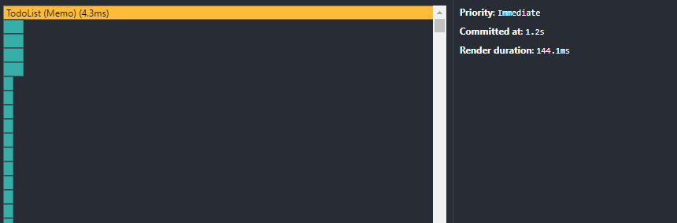
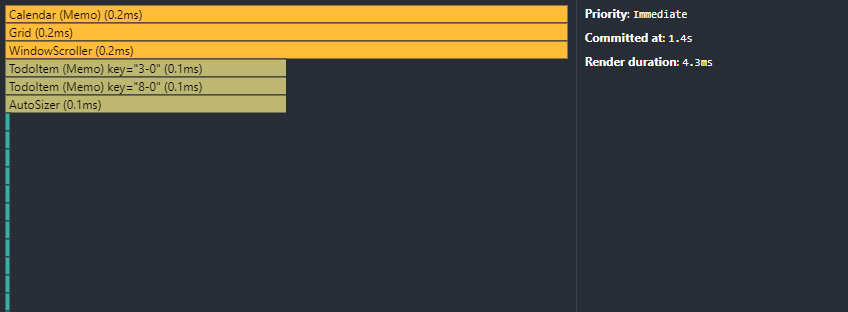

# Calendar-todolist

### uuid
### react-virtualized
2500개의 todo 더미데이터를 생성하여 테스트하였고 리렌더링에 소요된 시간을 144ms에서 4.3ms로 개선하였습니다.    
**개선 전**

**개선 후**

### Set 자료구조를 활용
- 중복이 없는 schedule날짜 데이터를 `Caledar`컴포넌트에 넘겨주었습니다.
- 달력에 schedule을 표시할때 Set의 내장 메소드 `has()`를 이용하여 반환되는 값으로 화면에 노출시켜주었습니다.