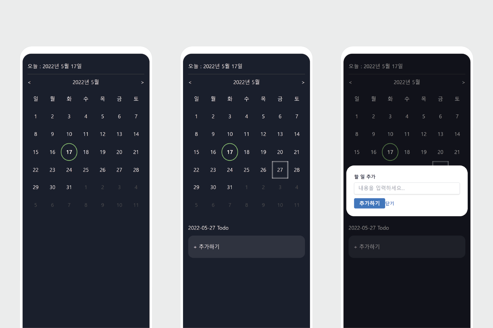
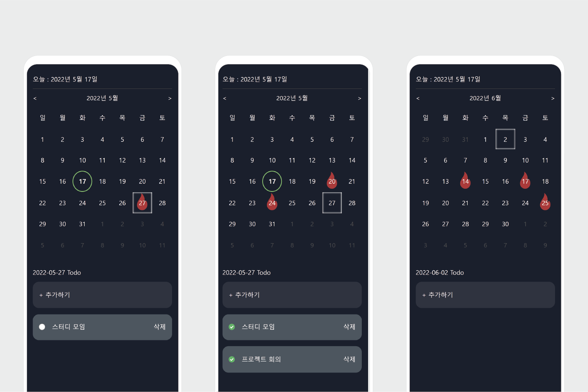

<h1 align="center">Welcome to calendar-todolist 👋</h1>
<p>
  
  <a href="#" target="_blank">
    
  </a>
</p>

> ✅ 달력으로 관리하는 TODO list

## Install

```sh
npm install
```

## Usage

```sh
npm run start
```

## Run tests

```sh
npm run test
```

## 프로젝트 소개

이 프로젝트는 기존의 투두 리스트 기능에 달력을 추가하여 보다 효율적인 일정 관리를 제공합니다. 
달력 기능은 라이브러리를 사용하지 않고 직접 구현하였습니다. 할 일이 특정 날짜에 추가되면 해당 
날짜에 달력에 표시됩니다. 이를 통해 일정을 한 눈에 파악하고 더욱 체계적으로 관리할 수 있습니다.

## 프로젝트 화면





## 배운점 & 경험

- React 프로젝트에서 TypeScript를 사용해보며 기초적인 TypeScript 문법을 익혔습니다.
- 2500개의 할 일 더미 데이터를 생성하여 랜더링 테스트를 해보았고, react-virtualized를 사용하여 리렌더링에 소요된 시간을 144ms에서 4.3ms로 개선하였습니다.

## Author

👤 **Byungho Park**

* Github: [@ho-1](https://github.com/ho-1)

## Show your support

Give a ⭐️ if this project helped you!

***
_This README was generated with ❤️ by [readme-md-generator](https://github.com/kefranabg/readme-md-generator)_